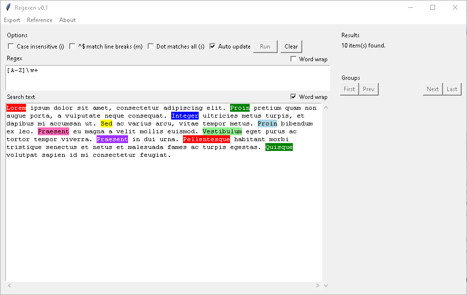

# Regexen

Regexen is a small Python 3 utility to test _regular expressions_. Example of Regexen running on Windows:

## Installation

Regexen relies on the **tkinter** package. If you're on Windows, you probably installed tkinter as part of your normal Python 3 installation. That being the case, all you need to do to run Regexen is double click on the script file.

If you are on Linux, you can install the tkinter package with

`sudo apt install python3-tk`

Or equivalent command, depending on your particular distribution.